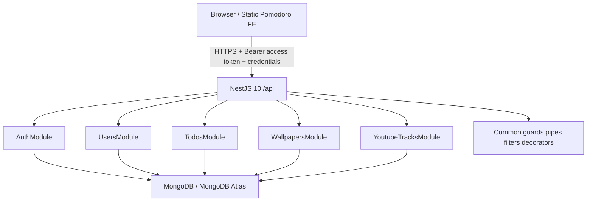

# Pomodoro Backend Technical Architecture

## 1. System overview

Pomodoro Backend là NestJS 10 REST API đứng giữa static frontend và MongoDB. Frontend gửi access JWT trong header và credentials cho refresh cookie; backend xác thực request, áp dụng ownership predicate và lưu cloud resources.



Backend không xử lý UI, Pomodoro, mixer hoặc anonymous LocalStorage. MongoDB là persistence layer cho authenticated users.

## 2. Technology stack

| Thành phần | Công nghệ |
|---|---|
| Framework | NestJS 10 |
| Runtime/platform | Node.js và Express |
| Language | TypeScript strict |
| Database | MongoDB / MongoDB Atlas |
| ODM | Mongoose 8 và `@nestjs/mongoose` |
| Authentication | Passport JWT, `@nestjs/jwt` |
| Password/token hashing | bcrypt |
| Validation | class-validator, class-transformer |
| Security headers | Helmet |
| Cookies | cookie-parser và HttpOnly refresh cookie |
| Rate limiting | `@nestjs/throttler` |
| Testing | Jest, ts-jest, Nest testing, Supertest |

## 3. Project structure

```text
PomodoroBE/
├── docs/
│   ├── PRD.md
│   ├── TECH_ARCHITECTURE.md
│   └── PLAN.md
├── src/
│   ├── main.ts                         # Bootstrap, middleware và global pipeline
│   ├── app.module.ts                   # Root module, MongoDB và global throttling
│   ├── config/
│   │   └── configuration.ts            # Environment-backed configuration
│   ├── auth/
│   │   ├── auth.controller.ts          # Register, login, refresh, logout
│   │   ├── auth.service.ts              # Credential validation và token lifecycle
│   │   ├── auth.module.ts
│   │   ├── dto/                         # Login/register DTOs
│   │   ├── guards/                      # JWT auth và refresh guards
│   │   └── strategies/                 # Access/refresh JWT strategies
│   ├── users/
│   │   ├── users.controller.ts         # Current-user profile endpoint
│   │   ├── users.service.ts
│   │   ├── users.module.ts
│   │   └── schemas/user.schema.ts
│   ├── youtube-tracks/
│   │   ├── youtube-tracks.controller.ts
│   │   ├── youtube-tracks.service.ts
│   │   ├── youtube-tracks.module.ts
│   │   ├── dto/
│   │   └── schemas/
│   ├── wallpapers/
│   │   ├── wallpapers.controller.ts
│   │   ├── wallpapers.service.ts
│   │   ├── wallpapers.module.ts
│   │   ├── dto/
│   │   └── schemas/
│   ├── todos/
│   │   ├── todos.controller.ts
│   │   ├── todos.service.ts
│   │   ├── todos.module.ts
│   │   ├── dto/
│   │   └── schemas/
│   └── common/
│       ├── decorators/                 # Current-user decorator
│       ├── filters/                    # HTTP exception filter
│       ├── guards/                     # Shared auth guards
│       ├── pipes/                      # ObjectId validation pipe
│       └── utils/                      # Shared ObjectId utilities
├── test/
│   ├── smoke.e2e-spec.ts
│   └── jest-e2e.json
├── jest.config.js
├── nest-cli.json
├── package.json
├── tsconfig.json
└── tsconfig.build.json
```

Các module feature giữ controller, service, DTO và schema gần nhau. `common/` chứa các thành phần cross-cutting được dùng bởi nhiều module; `test/` chứa cấu hình và smoke test e2e, còn unit tests nằm cạnh module tương ứng.

## 4. Bootstrap và cross-cutting pipeline

`src/main.ts` thực hiện:

1. Khởi tạo Nest application từ `AppModule`.
2. Bật Helmet.
3. Bật cookie-parser để đọc refresh cookie.
4. Bật CORS với configured origin, credentials, các HTTP methods và `Content-Type`/`Authorization` headers.
5. Bật global `ValidationPipe` với `whitelist`, `transform`, `forbidNonWhitelisted` và implicit conversion.
6. Bật global `HttpExceptionFilter`.
7. Đặt global prefix `/api`.
8. Listen trên port từ config, mặc định 3001.

`AppModule` cấu hình ConfigModule global, kết nối Mongoose bất đồng bộ và đăng ký Auth, Users, YouTube Tracks, Wallpapers và Todos modules. `ThrottlerGuard` được đăng ký qua `APP_GUARD`, nên throttling áp dụng global thay vì chỉ auth routes.

## 4. Module architecture

| Module | Trách nhiệm |
|---|---|
| Auth | Register/login, access-token issuance, refresh rotation, logout và auth controller |
| Users | User schema, profile query, password/refresh-token persistence |
| YouTube Tracks | CRUD track theo owner, extract video ID, timestamp sorting |
| Wallpapers | CRUD wallpaper theo owner, URL/type/label validation |
| Todos | CRUD todo theo owner, content/completed validation và timestamps |
| Common | JWT guards, current-user decorator, ObjectId pipe, error filter và shared utilities |

Mọi protected controller dùng JWT auth guard; resource mutation không dùng ID hoặc owner do client cung cấp ngoài route ID và DTO hợp lệ.

## 5. Data models và indexes

### User

- Email lowercase/trim/unique.
- Password hash, hidden khỏi query mặc định (`select: false`).
- Optional display name.
- Hashed refresh token, hidden khỏi query mặc định.
- `createdAt` và `updatedAt`.
- Collection rõ ràng là `users`.

### Todo

- `userId`.
- Required trimmed `content`, tối đa 500 ký tự qua DTO.
- `completed`, mặc định false.
- Mongoose timestamps.
- Index phục vụ user lookup.

### Wallpaper

- `userId`.
- `url`.
- `type`: `image | video | custom`.
- Optional `label`, tối đa 100 ký tự qua DTO.
- `addedAt`.
- User/timestamp index.
- Collection `wallpapers`.

### YouTube track

- `userId`.
- `url`, `videoId`, `title`.
- `addedAt`.
- User/timestamp index.
- Collection `youtube_tracks`.

`userId` của resource được tạo từ JWT. List query luôn có owner predicate; update/delete dùng điều kiện `_id + userId` để đảm bảo cross-user isolation.

## 6. Authentication architecture

### Register/login

1. DTO được validate bởi global ValidationPipe.
2. Password được hash bằng bcrypt 12 rounds.
3. AuthService tạo access JWT 15 phút và refresh JWT 7 ngày.
4. Response JSON trả `{ accessToken, user }`.
5. Refresh JWT được hash lưu trong User và set vào HttpOnly cookie.

### Refresh

1. Client gọi `POST /api/auth/refresh` với credentials.
2. Refresh strategy đọc cookie tại path `/api/auth/refresh` và xác thực refresh secret.
3. Backend tìm user kèm hashed refresh token, so sánh token hash.
4. Nếu hợp lệ, token được rotate: hash cũ bị thay thế, cookie mới được set và access token mới được trả về.
5. Replay hoặc token không khớp hash hiện tại bị từ chối.

### Logout

Backend xóa refresh token đã lưu, clear cookie với cùng path và trả response thành công. Frontend xóa access token memory và user state.

Cookie flags: `httpOnly`, `sameSite: strict`, `secure` ở production, `maxAge` theo refresh expiration và path `/api/auth/refresh`.

## 7. API contract

Tất cả route có prefix `/api`.

| Resource | Endpoints |
|---|---|
| Auth | `POST /auth/register`, `/login`, `/refresh`, `/logout` |
| Users | `GET /users/me` |
| YouTube tracks | `GET/POST /youtube-tracks`, `DELETE /youtube-tracks/:id` |
| Wallpapers | `GET/POST /wallpapers`, `DELETE /wallpapers/:id` |
| Todos | `GET/POST /todos`, `PATCH/DELETE /todos/:id` |

DTO constraints:

- Register: email hợp lệ, password 6–128 ký tự, displayName tối đa 100.
- Todo create/update: content tối đa 500, completed boolean; update cho phép content/completed và không được rỗng.
- Wallpaper create: URL hợp lệ, enum image/video/custom, label tối đa 100.
- YouTube track create: URL hợp lệ, title bắt buộc, videoId tùy chọn.
- Non-whitelisted fields bị từ chối.

## 8. Error và security architecture

Error response chuẩn:

```json
{
  "statusCode": 400,
  "message": "Invalid ObjectId",
  "error": "Bad Request",
  "timestamp": "2026-08-25T10:00:00.000Z",
  "path": "/api/todos/not-an-id"
}
```

- `400`: DTO, schema hoặc malformed ObjectId.
- `401`: access JWT thiếu, sai hoặc hết hạn.
- `404`: resource missing/cross-owner.
- `409`: duplicate key, đặc biệt duplicate email.

Security boundaries:

- JWT guards bảo vệ protected routes.
- ObjectId pipe chặn malformed IDs trước khi vào Mongoose.
- Atomic owner queries tránh ID enumeration giữa users.
- Global validation chặn fields ngoài DTO.
- Exception filter sanitize database/CastError/duplicate-key details.
- Helmet thêm security headers.
- CORS credentials phải khớp frontend origin.
- Throttling global qua `APP_GUARD`, dùng `THROTTLE_TTL` và `THROTTLE_LIMIT` từ environment; auth-specific limits được cấu hình ở auth controller/module nếu áp dụng.

## 9. Configuration và deployment

Environment variables:

- `PORT` — mặc định 3001.
- `NODE_ENV` — runtime environment.
- `MONGODB_URI` — MongoDB connection string bắt buộc.
- `JWT_ACCESS_SECRET` — access secret bắt buộc.
- `JWT_REFRESH_SECRET` — refresh secret bắt buộc.
- `JWT_ACCESS_EXPIRATION` — mặc định `15m`.
- `JWT_REFRESH_EXPIRATION` — mặc định `7d`.
- `CORS_ORIGIN` — frontend origin, mặc định local development `http://localhost:3000`.
- `THROTTLE_TTL` và `THROTTLE_LIMIT` — global throttling configuration.

Không commit MongoDB credentials hoặc JWT secrets. Production nên dùng MongoDB Atlas, HTTPS và compiled entrypoint `dist/main`. CORS origin backend phải khớp static frontend origin để cookie credentials hoạt động.

## 10. Testing architecture

- Unit tests cho Auth, ObjectId pipe, Todos và Wallpapers chạy không cần database.
- E2E smoke test hiện tại xác nhận Jest e2e configuration.
- Full HTTP e2e phải dùng `MONGODB_TEST_URI` hoặc database test cô lập, tuyệt đối không dùng Atlas production.
- Manual verification cần bao gồm register, login, profile, resource CRUD, malformed ID, cross-user isolation, refresh rotation/replay và logout.
- Build, unit tests và smoke e2e được theo dõi riêng với full database-backed verification còn deferred.
